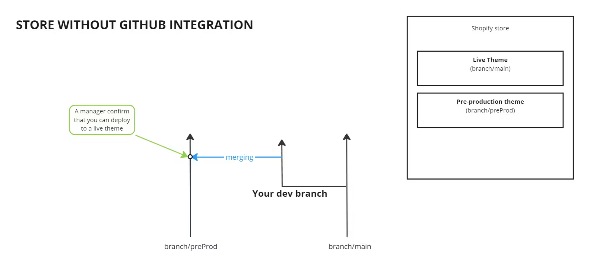
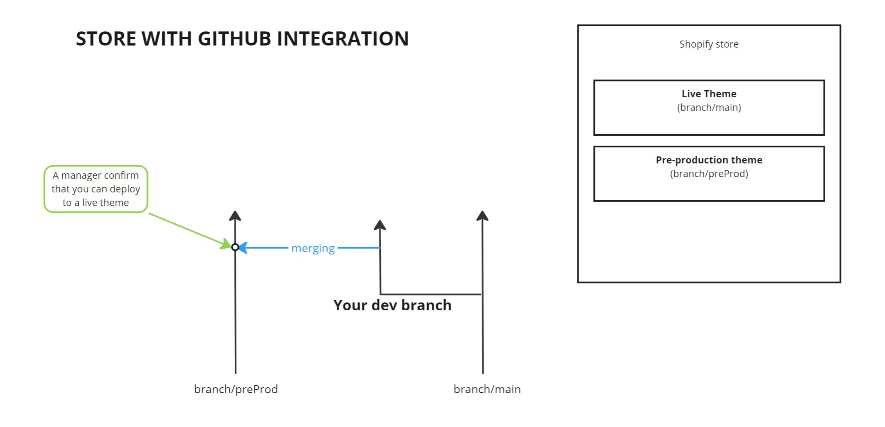

# 🛣️ Development Flow

## **Developers tools**

1. Describe Front end development workflow using Shopify CLI.
    
    - How to login in to a store via CLI?
        
    - How to start dev env?
        
    - How to add some files to the CLI ignore?
        
    - How to push/pull data to the exact theme?
        
    - What does `shopify theme share` do?
        
    - How to set up the dev env that reloads a page entirely when something changes in the code?
        
    - What does `-theme-editor-sync` flag do?
        
    - What is `shopify.theme.toml` ?
        
2. Describe Front end development workflow using Themekit?
    
3. What difference between Shopify CLI and ThemeKit, and when we should use CLI and when ThemeKit?
    

## **Git**

1. What is Shopify GitHub integration?
    
    - List the advantages of using this integration
        
    - How to connect a GitHub branch to a store?
        
2. Git Flow
    
    - Describe how to organize work for several developers in one Shopify store.
        
    - How would you manage the following tasks?

