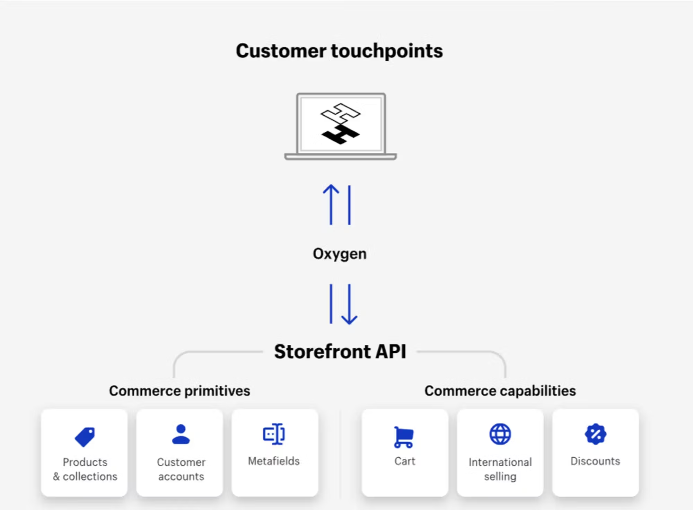
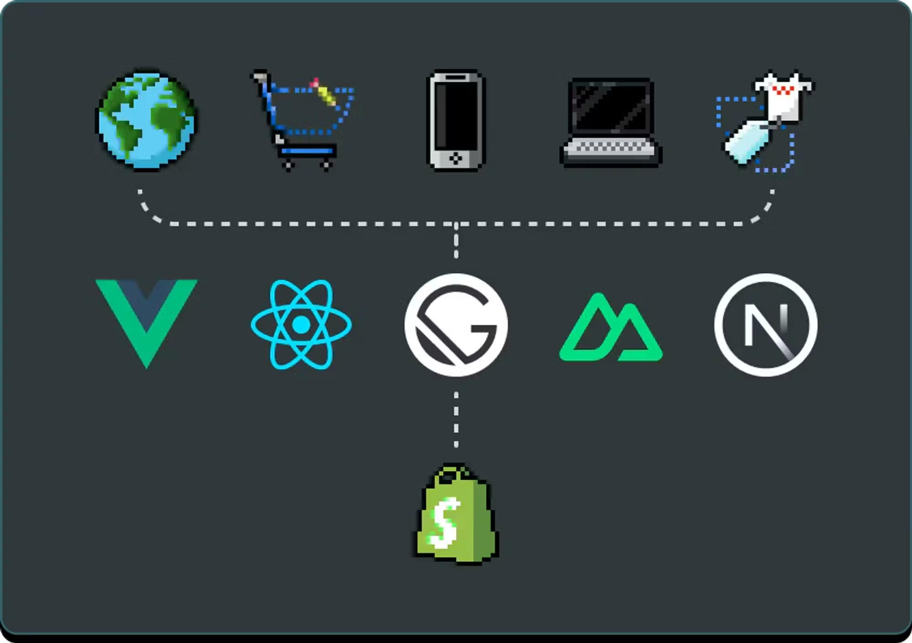
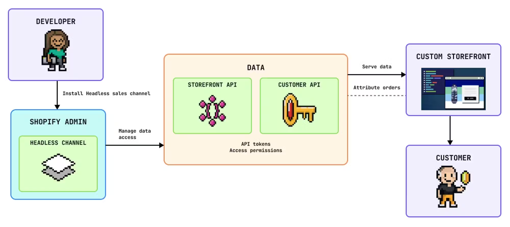
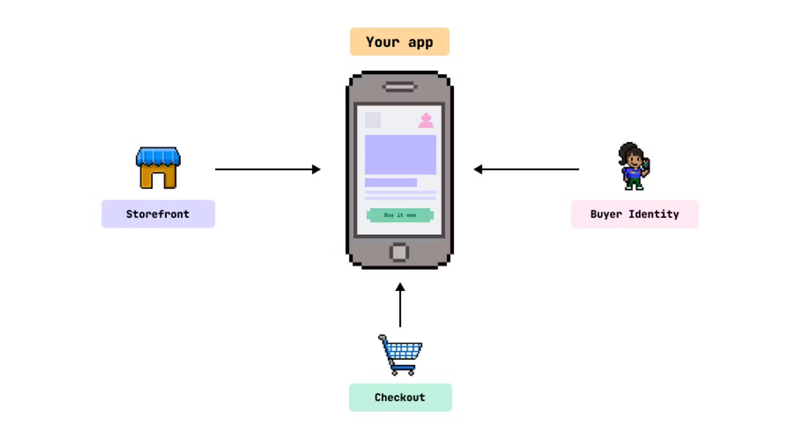

# Shopify Storefront Development - Intro to the Headless Approach

## 1. **Hydrogen & Oxygen**

Shopify's official headless development stack consists of **Hydrogen** and **Oxygen** — a set of tools designed to provide a clear path for building fast, scalable, and dynamic headless commerce storefronts.

**Hydrogen** is a React-based framework that combines modern development principles such as Optimistic UI, Nested Routes, and Progressive Enhancement. It comes with pre-configured commerce-specific components, hooks, and utilities tailored to work seamlessly with the Shopify API. The stack is modular and performance-optimized, giving developers a strong foundation without limiting flexibility. It also allows easy integration with any third-party tools or services already used in your tech ecosystem.

While Hydrogen storefronts can be hosted on any cloud provider, the **simplest and most optimized way** to deploy is via **Oxygen** — Shopify's global edge-hosting solution. Oxygen offers rendering at the edge with 285+ points of presence worldwide. It gives developers full control over deployment and is included in all Shopify plans at no additional cost. This ensures maximum performance and uptime across the globe while reducing infrastructure costs.

📘 Learn more about Hydrogen [here](https://shopify.dev/docs/custom-storefronts/hydrogen/getting-started)

## 2. **Custom Tech Stack**

Shopify also supports full **tech stack flexibility**. Developers can use any frontend framework, infrastructure, or hosting provider to create a custom storefront experience. Through the **Headless sales channel**, Shopify APIs can be integrated directly into existing systems and workflows.

This approach is ideal for teams that already work with technologies like Vue.js, Svelte, Angular, or prefer building with their own internal architecture. API-based access enables complete freedom to design and develop without being limited to Shopify's theme structure.

📘 Learn more about custom headless builds [here](https://shopify.dev/docs/custom-storefronts/headless)

## 3. **Mobile App Integration**

If you're building a **native mobile app**, Shopify provides dedicated SDKs to bring ecommerce functionality directly into your mobile experience.

Supported platforms include:

- **iOS (Swift)**
- **Android**
- **React Native**

These SDKs allow developers to connect to the Shopify backend for product data, checkout, and customer sessions — all with secure and high-performing native integrations.

📘 Learn more about mobile integrations [here](https://shopify.dev/docs/custom-storefronts/mobile-apps)

## 💡 **Key Considerations**

While headless Shopify development — particularly with Hydrogen and Oxygen — offers powerful flexibility, scalability, and performance, it introduces certain trade-offs and challenges compared to traditional theme-based setups.

Here are the key points to keep in mind:

- **Higher development costs**  
  Building and maintaining a custom storefront requires more time, technical expertise, and ongoing support compared to using standard Shopify themes.

- **No visual builder**  
  With headless setups, you lose access to Shopify's built-in **Theme Customizer**. Any visual editing or layout adjustments must be implemented directly in code or recreated through a custom admin interface — significantly increasing project complexity.

- **App Store limitations**  
  Most apps in the **Shopify App Store** are built to automatically integrate with Shopify themes using embedded scripts, theme blocks, or native UI extensions.

  In headless environments:

  - These automatic integrations **don't work out of the box**
  - Developers must implement all app functionality **manually using APIs**
  - Some app features may be **partially or entirely incompatible**, or require workarounds

- **Developer-focused tooling**  
  Hydrogen and other headless solutions are built specifically for developers. They provide complete control and power — but require a team comfortable with code-driven development and ongoing technical maintenance.

**Summary**  
> Headless architecture offers unmatched customization and performance — but it also demands deeper technical resources and a higher level of planning.
> There's no "one-size-fits-all" approach. The best choice depends on your **business goals**, **technical capabilities**, and **budget**.
