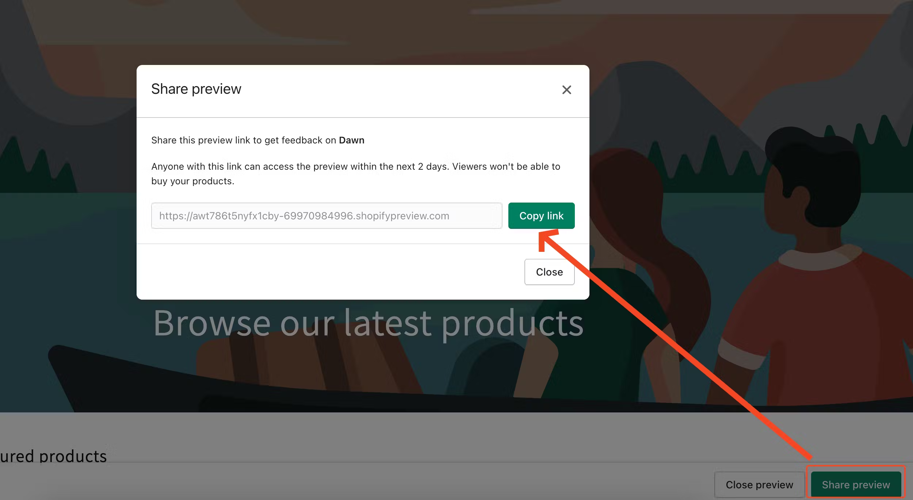
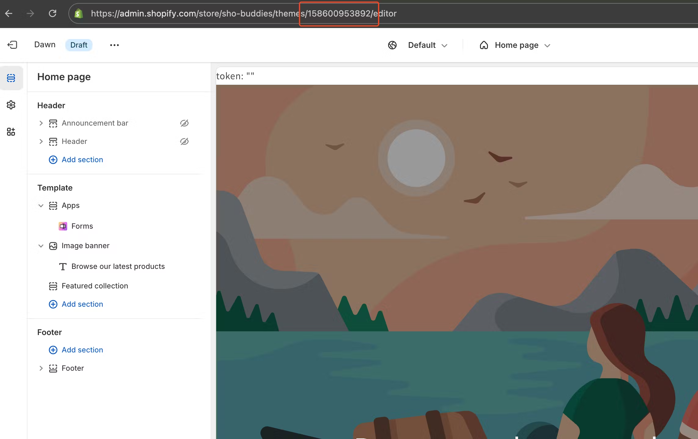
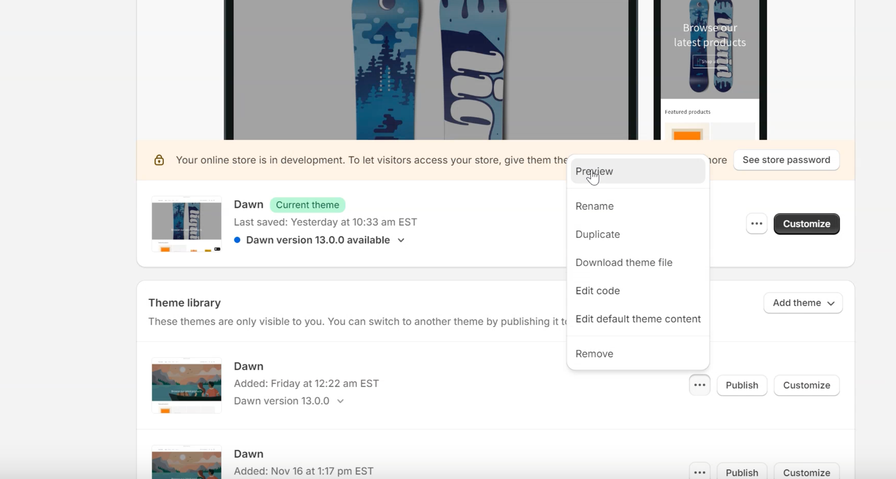
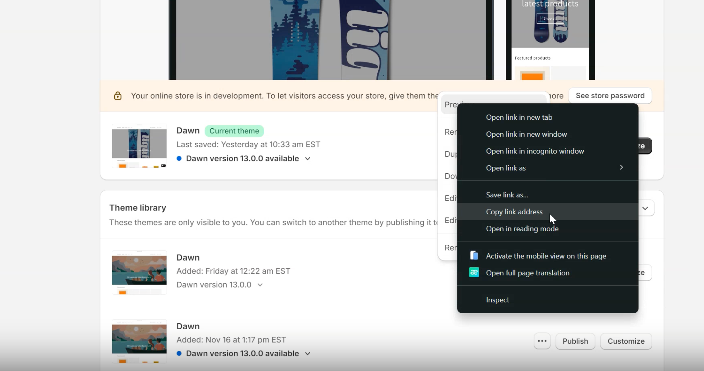

# 📮 Sharing Preview Links During Theme Development

When a team is actively working on a project and needs to regularly share progress with clients or other stakeholders, **preview links** for development themes are commonly used.

However, there’s one major downside to this approach: **preview links expire after 48 hours**. This can easily lead to confusion or unnecessary concern if a client or teammate tries to access an outdated link. If the link no longer works, they might assume something is broken or missing.

Fortunately, there’s a more reliable solution.

Every theme in Shopify has a **unique ID**, and you can use this ID to create a **permanent preview link** that doesn’t expire. Instead of generating a temporary preview link, simply include the `preview_theme_id` parameter in the URL — Shopify will automatically load the correct version of the theme.  
  
You can find the theme ID in the URL when the theme is open in the **Theme Customizer**.

Here’s an example of a permanent preview link using a theme ID:

🔗 `https://test-store.com?preview_theme_id=155153826068`  
  
Alternatively, you can simply copy the preview link this way:

This method might seem obvious once you know it — but many people are unaware, which often leads to confusion and unnecessary back-and-forth. Using permanent theme preview links makes the review process smoother and ensures everyone stays aligned during development.