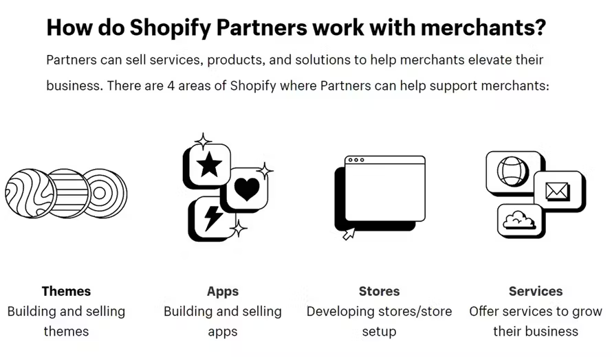
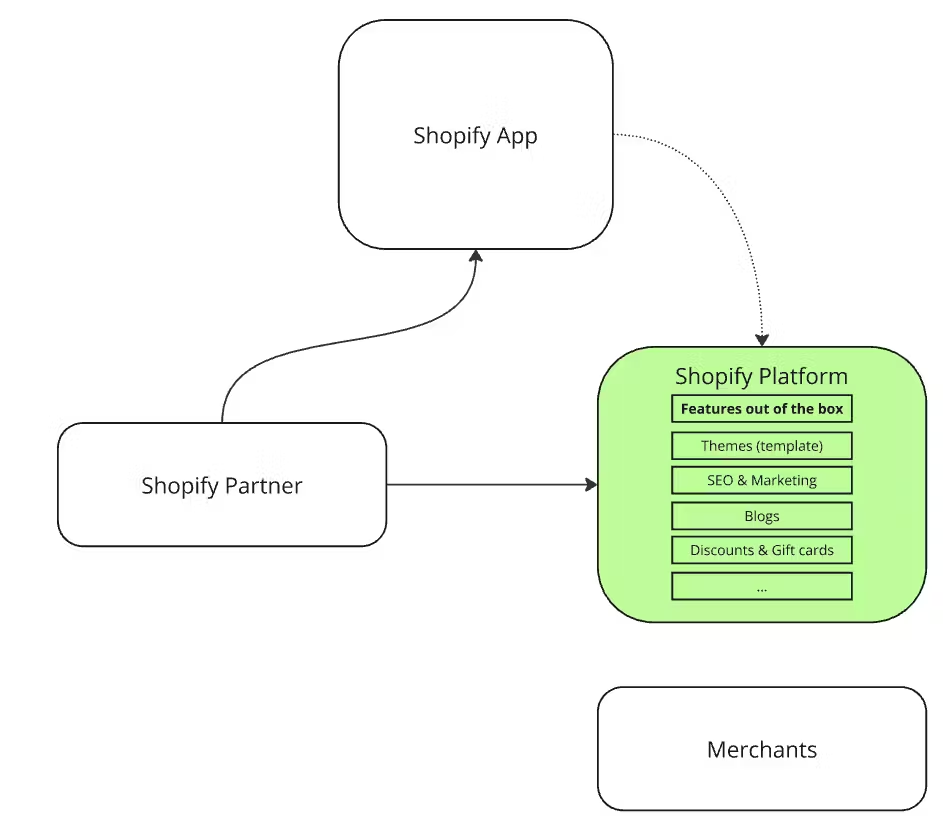

# 🕵️‍♂️Who’s Who in the Shopify Partner Ecosystem 

Shopify’s true strength goes beyond its core platform — it lies in the global network of partners who bring ideas to life, customize functionality, and help ecommerce businesses grow at every stage.

But not all partners serve the same purpose. Some focus on design, others build apps, and many offer end-to-end services that touch every part of a merchant’s business.

In this article, we’ll break down the different types of Shopify Partners, what they do, and how they contribute to the success of merchants around the world.

## 🧩 Types of Shopify Partners

Shopify's partner ecosystem includes a diverse mix of roles — each bringing unique value to both merchants and the platform.

### 🎨 Theme Developers

Front-end developers — often called **Shopify Theme Developers** — are responsible for building or customizing the **storefront**, which is the customer-facing part of a Shopify store.

Traditionally, they work with:

- **Liquid** — Shopify’s templating language
    
- **HTML, CSS, and JavaScript** — for structure, styling, and interactivity
    
- **Theme tools** — such as Shopify CLI, the Dawn theme, and the visual Theme Editor
    

Their goal is to deliver fast, responsive, and branded shopping experiences using Shopify’s out-of-the-box capabilities.

### 🧠 What About Headless?

In more advanced use cases, some developers take a **headless** approach — separating the frontend from Shopify’s backend. This allows for full design control and performance optimization using modern frameworks like:

- **Next.js**
    
- **Remix**
    
- others
    

In a headless architecture, the storefront becomes a standalone application that communicates with Shopify via the **Storefront API** or **GraphQL Admin API**. This approach enables:

- Blazing-fast page speeds through static generation or server-side rendering
    
- Full control over user experience and interface
    
- Easier integration with third-party systems
    

While more complex, headless architecture is growing in popularity among larger merchants who demand flexibility, speed, and custom UI/UX.

> 💡 Both approaches — traditional themes and headless — have their strengths and trade-offs. There’s no “best” solution, only the one that fits your business goals and technical capacity.

### ⚙️ App Developers

Back-end developers play a crucial role in Shopify’s ecosystem by building **Shopify Apps** — tools that extend the platform’s built-in functionality. Shopify provides a strong ecommerce core, but apps are how merchants unlock truly custom experiences.

Apps can be:

- **Custom apps** — tailored for one merchant’s specific needs
    
- **Public apps** — published to the Shopify App Store and used by thousands
    

These apps typically run as external web applications and connect to Shopify using **REST or GraphQL APIs**. Popular stacks include **Node.js**, **React**, and **PostgreSQL**.

#### 📦 What Do Shopify Apps Do?

Apps add features, automate workflows, and integrate Shopify with other platforms. They’re essential for adapting Shopify to fit any business model.

Examples include:

- **Inventory and fulfillment automation**  
    Sync stock across locations, trigger fulfillment events, or manage dropshipping.
    
- **Custom product logic**  
    Add subscription options, tiered pricing, product bundles, or dynamic checkout flows.
    
- **Sales and marketing tools**  
    Build loyalty programs, upsell systems, and referral tracking.
    
- **Third-party integrations**  
    Connect Shopify with CRMs (e.g., Salesforce), ERPs (e.g., NetSuite), and accounting or shipping platforms.
    
- **Admin tools and dashboards**  
    Create custom merchant-facing dashboards and Shopify Admin UI enhancements using App Bridge.
    

#### 🧠 Why Apps Matter

Apps allow developers to tailor Shopify for businesses with complex, industry-specific, or rapidly evolving needs. They’re where **technical creativity meets real-world challenges**, and they power much of the innovation within the ecosystem.

### 🏗️ Agencies & Full-Service Partners

Agencies provide **end-to-end services** — offering strategy, design, development, and marketing under one roof. They often work with cross-functional teams that include:

- Designers and front-end developers
    
- Back-end and app developers
    
- Marketers and strategists
    

They typically support merchants with:

- Full custom store builds
    
- Platform migrations
    
- Ongoing technical and UX optimization
    
- Conversion rate optimization (CRO) and growth marketing
    

Agencies are ideal for merchants seeking a **long-term partner** or launching complex, high-volume stores.

### 🔌 Integration Partners & Tech Providers

These partners specialize in **connecting Shopify to external systems**, enabling operational efficiency and scaling behind the scenes.

They help merchants:

- Integrate with ERPs, POS systems, fulfillment networks, or PIMs
    
- Build custom APIs and data pipelines
    
- Automate cross-platform workflows using tools like **Zapier** or custom scripts
    

These partners are essential for mid-size to enterprise merchants managing complex operations and multiple business systems.

### 📣 Marketing Partners

Marketing-focused partners drive **customer acquisition and retention**. They specialize in:

- Paid media and performance marketing (e.g., Meta Ads, Google Ads, TikTok)
    
- SEO and content strategy
    
- Email and SMS marketing automation
    
- Loyalty, affiliate, and referral program setup
    

They often work with platforms like **Klaviyo**, **Yotpo**, **Postscript**, or **ReConvert**, ensuring that campaigns are integrated, data-driven, and optimized for performance.

## 💡 Final Thoughts

Understanding the different types of Shopify Partners helps merchants, managers, and developers make smarter decisions — whether you're building a store, scaling an existing one, or launching your own service in the ecosystem.

Each partner brings something unique to the table — and when they collaborate effectively, the Shopify ecosystem becomes more powerful than the sum of its parts.

> 🔄 The best results happen when the right partners work together to create something tailored, scalable, and impactful.

