# VaanTalk — Key to Success: Prototyping & Communication

A talk about prototyping and communication in development. Learn why clear communication and visual prototyping often save more time than perfect code.

**Date:** 2025-12-25

---

I recently gave a talk at **VaanTalk**, where I spoke about something that keeps coming back in my daily work: prototyping and communication.

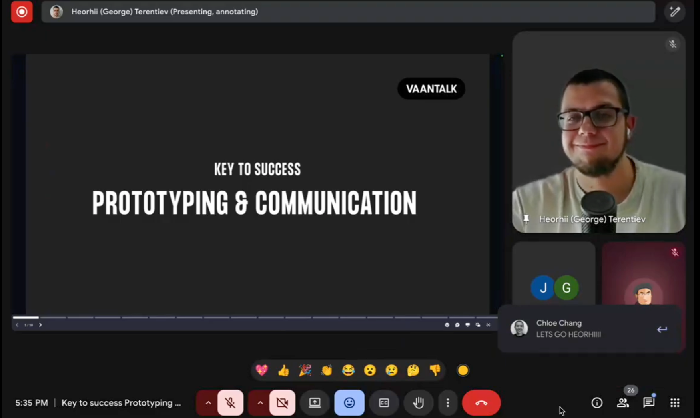

The talk was intentionally not about new frameworks, AI tools, or developer trends. Instead, it focused on a more fundamental part of our job that often gets overlooked.

## Developers as a bridge

I strongly believe that a developer's role goes beyond writing code. In practice, we often act as a bridge between different worlds:

- business and implementation
- ideas and constraints
- expectations and reality

Code is usually the *last* step in that process.

## Why prototyping matters

Prototyping — especially visual prototyping — helps reduce misunderstandings early. It creates a shared reference point that allows everyone involved to talk about the same thing, even if they don't share the same technical language.

In the talk, I explored:

- why prototyping is not just a "design thing"
- different levels of prototyping (from rough sketches to interactive demos)
- real examples where prototyping prevented costly mistakes

Most of these examples came directly from real project experience, not theory.

## A recurring lesson

Preparing this talk reminded me of something simple but important:

> **Tip:** Clear communication often saves more time than writing "perfect" code.

The better we explain, visualize, and validate ideas early, the smoother the implementation phase becomes.

---

## Presentation slides

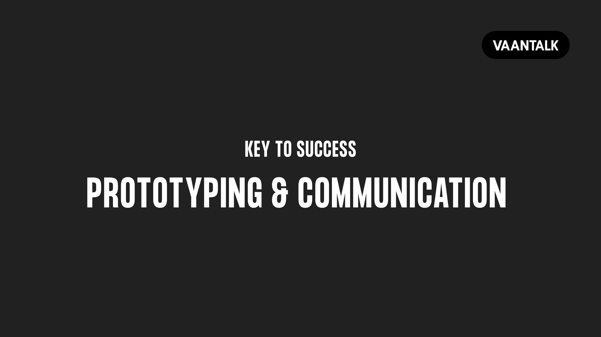
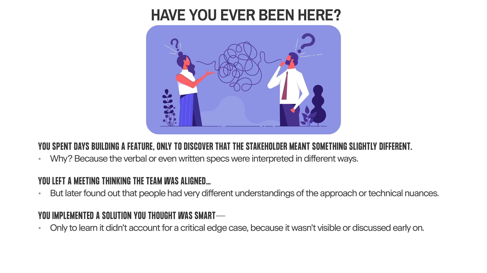
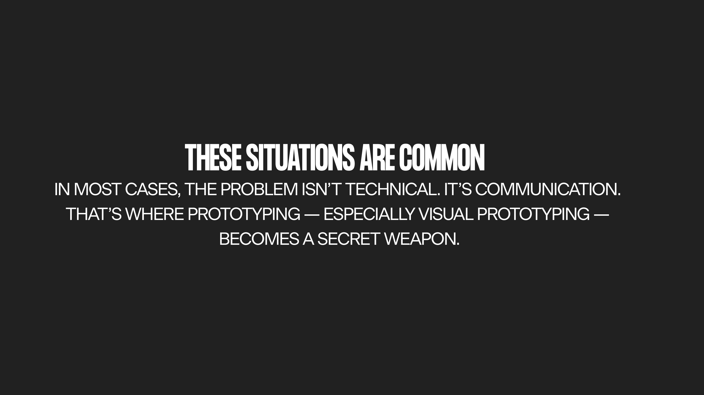
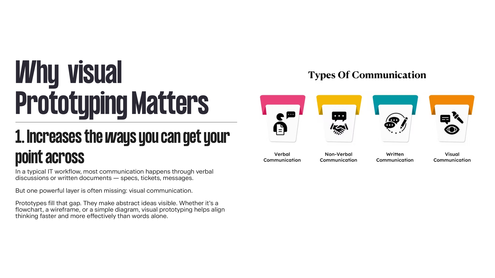
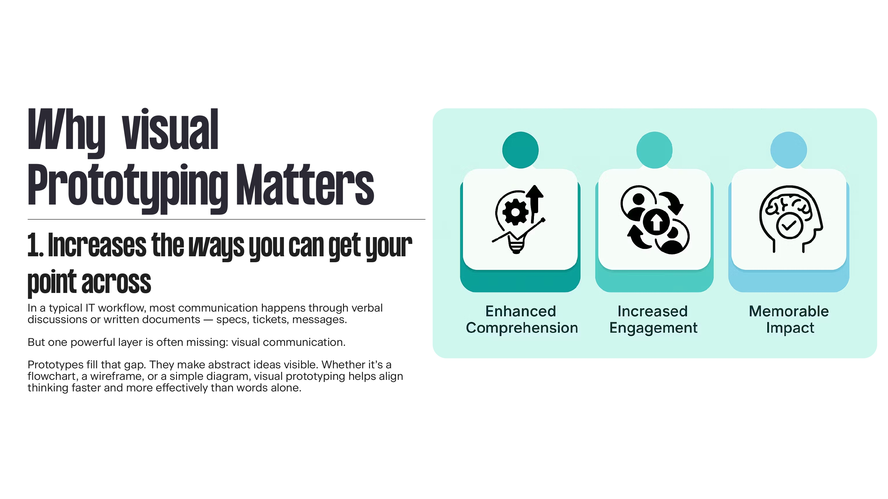
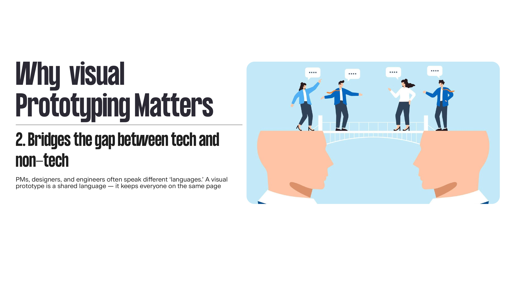
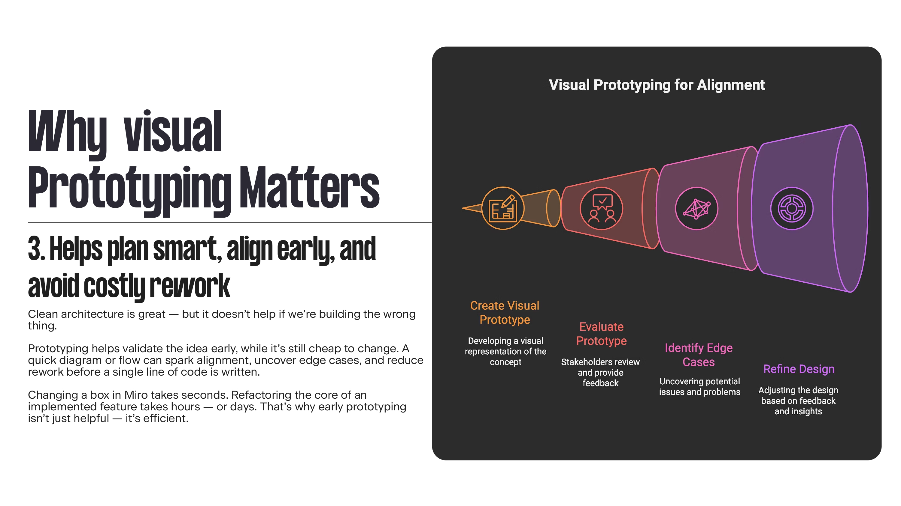
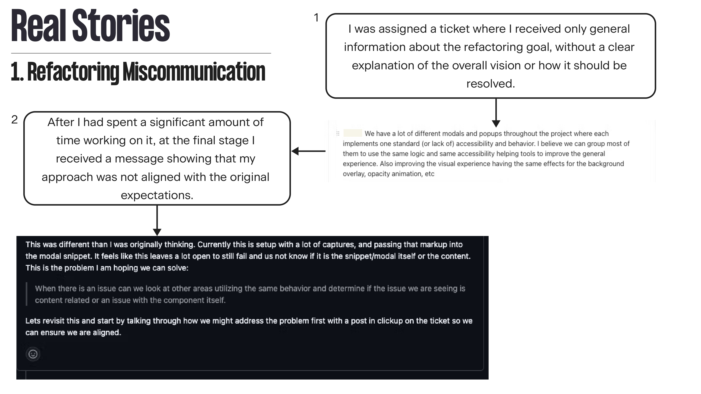
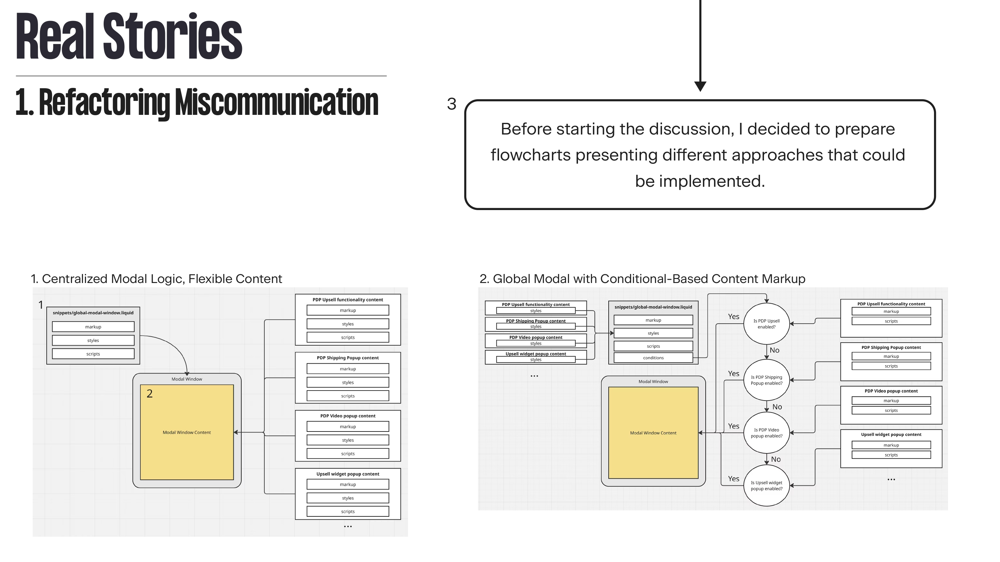
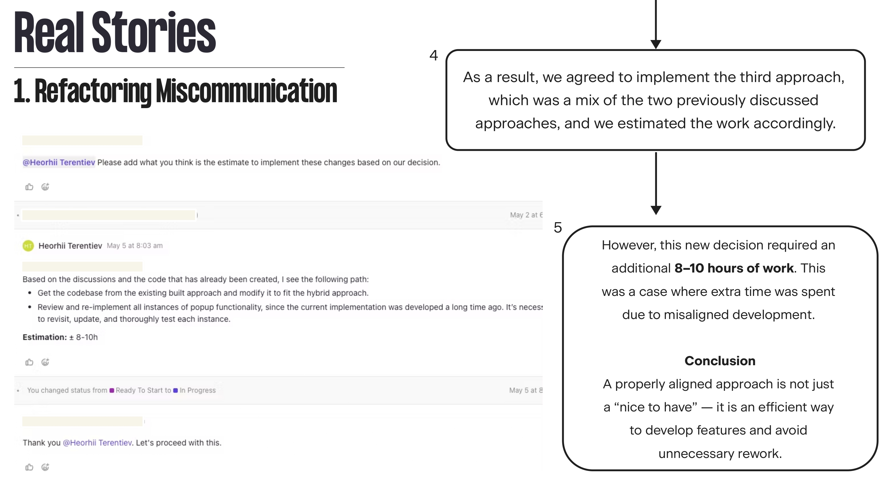
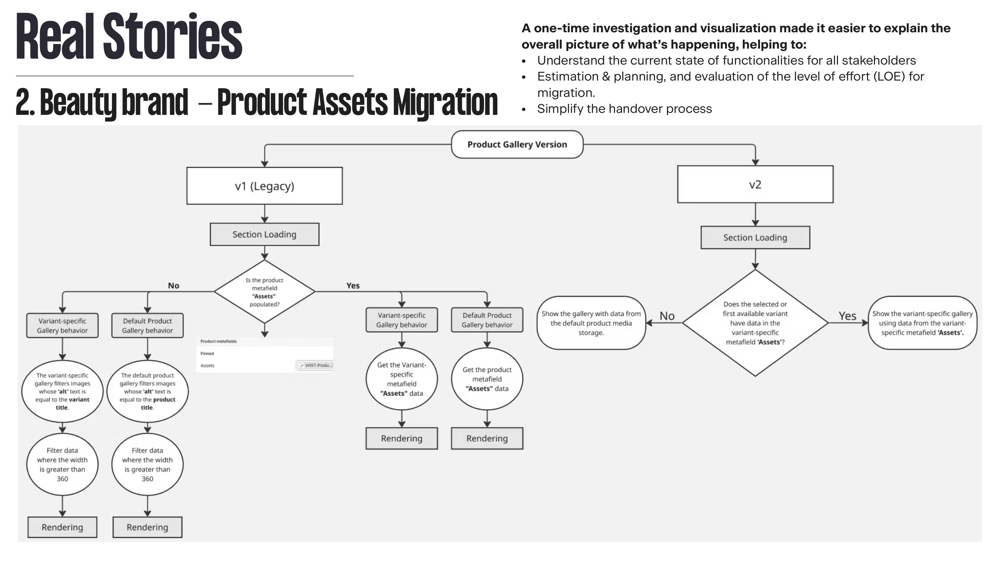
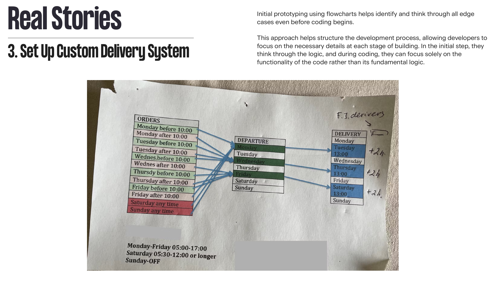
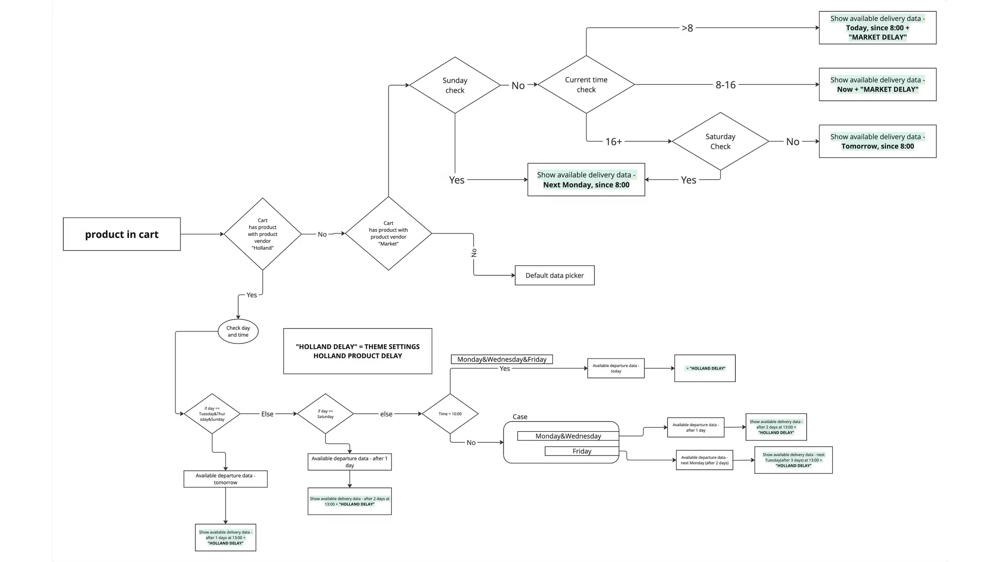
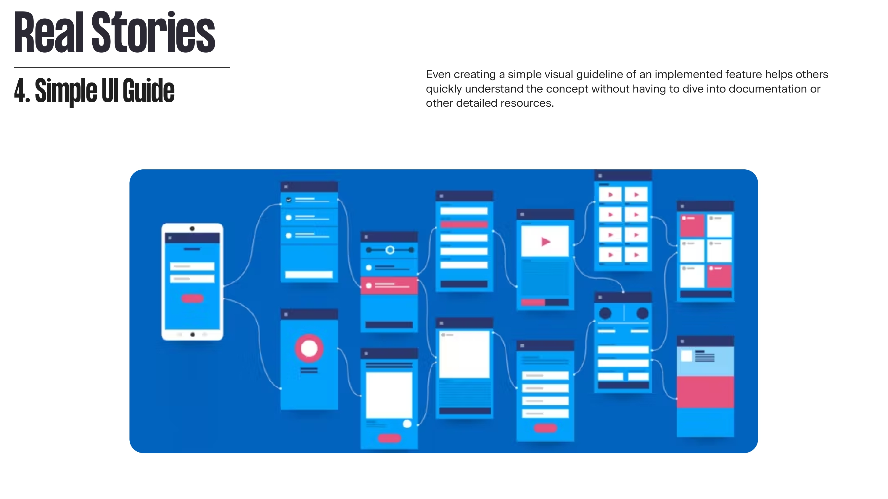
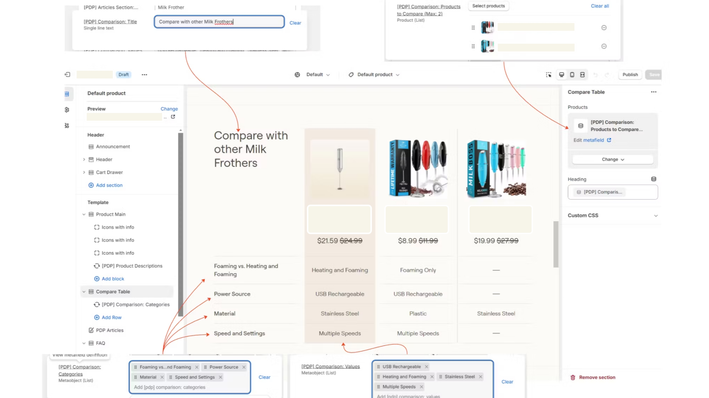
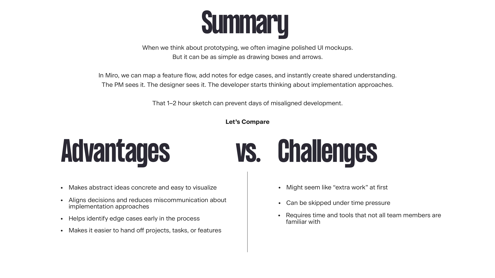

**[Download PDF](../../assets/talks/vaantalk-presentation.pdf)**

---

I hope it helps others refine how they communicate ideas and approach daily development work.
